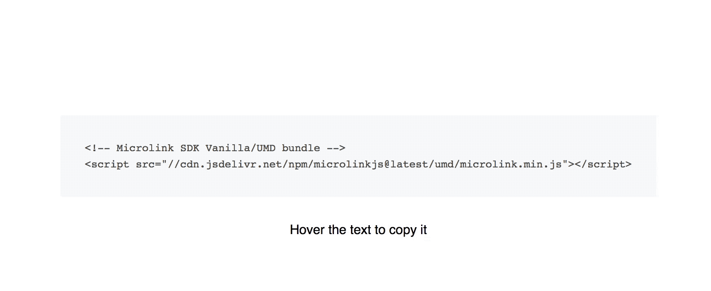

# react-codecopy

<p align="center">
  
</p>


[](https://travis-ci.org/Kikobeats/react-codecopy)
[](https://david-dm.org/Kikobeats/react-codecopy)
[](https://david-dm.org/Kikobeats/react-codecopy#info=devDependencies)
[](https://www.npmjs.org/package/react-codecopy)
[](https://paypal.me/Kikobeats)

> "Copy to clipboard" button for your code snippets. Inspired in [codecopy](https://github.com/zenorocha/codecopy).


## Install

```bash
$ npm install react-codecopy --save
```

## Usage


```jsx
import CodeCopy from 'react-codecopy'

<CodeCopy>
  <pre>
    <code>{`<!-- Microlink SDK Vanilla/UMD bundle -->
<script src="//cdn.jsdelivr.net/npm/microlinkjs@latest/umd/microlink.min.js"></script>`}</code>
  </pre>
</CodeCopy>
```

Additionally you can specify `iconComponent`.

## Related

- [codecopy](https://github.com/Kikobeats/codecopy) – "Copy to clipboard" button for your code snippets.

## License

**react-codecopy** © [Kiko Beats](https://kikobeats.com), released under the [MIT](https://github.com/Kikobeats/react-codecopy/blob/master/LICENSE.md) License.<br>
Authored and maintained by Kiko Beats with help from [contributors](https://github.com/Kikobeats/react-codecopy/contributors).

> [kikobeats.com](https://kikobeats.com) · GitHub [Kiko Beats](https://github.com/Kikobeats) · Twitter [@Kikobeats](https://twitter.com/Kikobeats)
